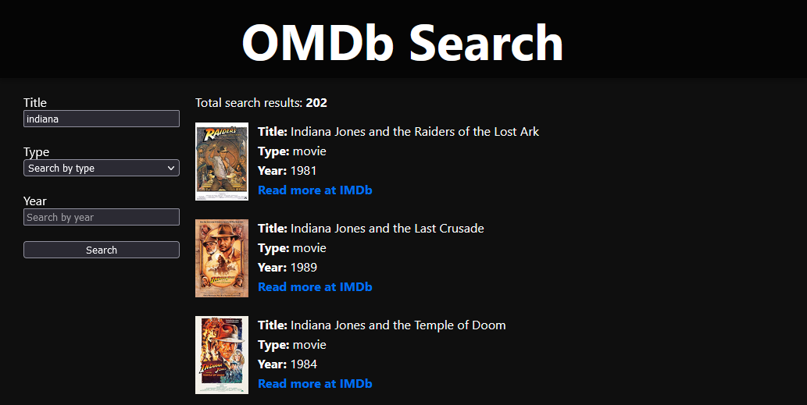

# OMDb-search

This is a simple search that integrates with [the open external OMDB API for making searches in the
movie database](http://www.omdbapi.com/).

You will be able to search by `title`, `type` and `year` for movies, series or episodes.

The search results are paginated with 10 results per page and utilize an infinite scroll.



## Prerequisites

To get started, [generate a new API Key for the OMDb API here](http://www.omdbapi.com/apikey.aspx).

You will receive an e-mail with your API Key. Copy this key and create a new file in the root of this project named:

### `.env.local`

In this file, add your API Key by replacing `<YOU_API_KEY_HERE>` with your key:

```js
NEXT_PUBLIC_API_KEY=<YOU_API_KEY_HERE>
```

---

This is a [Next.js](https://nextjs.org/) project bootstrapped with [`create-next-app`](https://github.com/vercel/next.js/tree/canary/packages/create-next-app).

## Getting Started

First, run the development server:

```bash
npm run dev
# or
yarn dev
```

Open [http://localhost:3000](http://localhost:3000) with your browser to see the result.

You can start editing the page by modifying `pages/index.tsx`. The page auto-updates as you edit the file.

[API routes](https://nextjs.org/docs/api-routes/introduction) can be accessed on [http://localhost:3000/api/hello](http://localhost:3000/api/hello). This endpoint can be edited in `pages/api/hello.ts`.

The `pages/api` directory is mapped to `/api/*`. Files in this directory are treated as [API routes](https://nextjs.org/docs/api-routes/introduction) instead of React pages.

## Learn More

To learn more about Next.js, take a look at the following resources:

- [Next.js Documentation](https://nextjs.org/docs) - learn about Next.js features and API.
- [Learn Next.js](https://nextjs.org/learn) - an interactive Next.js tutorial.

You can check out [the Next.js GitHub repository](https://github.com/vercel/next.js/) - your feedback and contributions are welcome!

## Deploy on Vercel

The easiest way to deploy your Next.js app is to use the [Vercel Platform](https://vercel.com/new?utm_medium=default-template&filter=next.js&utm_source=create-next-app&utm_campaign=create-next-app-readme) from the creators of Next.js.

Check out our [Next.js deployment documentation](https://nextjs.org/docs/deployment) for more details.
